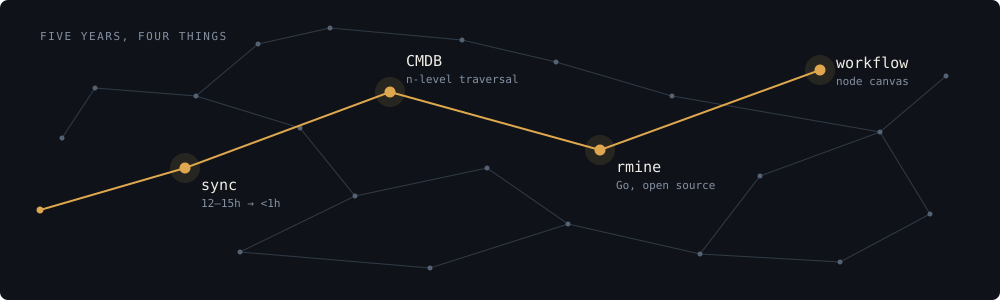

## Mehboob Ali

**Principal Software Engineer** &nbsp;·&nbsp; Lahore, Pakistan &nbsp;·&nbsp; [mehboob.dev](https://mehboob.dev)

Five years at [7Vals](https://7vals.com) on Rails backends and IT-asset systems. I led the CMDB build
and I run the Workflow Automation program now. The tooling side got interesting along the way: a
Redmine CLI, Claude Code skills, an agent that turns tickets into pull requests.

  
  
  
  
  
  

### What I've shipped

**[The sync job that took half a day](https://mehboob.dev/blog/the-sync-job-that-took-half-a-day/)** &nbsp;·&nbsp; `Rails` `Delayed Job` `PostgreSQL`
> A device sync was taking 12 to 15 hours to run, so new hardware wouldn't show up for most of a
> working day. N+1 queries and no batching, on a table that had been collecting devices for years.
> Rebuilt around batched writes: under an hour now, and every MDM integration added since is built
> on the same pattern.

**Automation that could branch** &nbsp;·&nbsp; `Rails` `React Flow` `ITSM`
> Automation used to be one trigger paired with one sub-trigger. Fine for a one-step rule, out of
> room past that. It's a node canvas now: actions chain, each branches on success or failure, and
> every run writes a step-by-step log, so a rule that misfires can be read instead of guessed at.
> Led technical delivery: five months, eight engineers. It's the program I still run.
> [Documented by EZO ↗](https://ezo.io/assetsonar/blog/automation-engine/)

**A CMDB that actually models relationships** &nbsp;·&nbsp; `Rails` `PostgreSQL` `Graph modeling`
> Most CMDBs are static. An asset points at a user, maybe a location, and anything past that takes
> a support ticket. This one answers *everything touching this server, three hops out*: a data model
> with n-level traversal plus the ITSM-integrated UI on top. Seven months architecture to production,
> leading a five-person team.
> [Documented by EZO ↗](https://ezo.io/assetsonar/blog/visualize-cmdb-relationships-assetsonar-it-graph/)

Four titles in five years, and what stayed behind after each one: [mehboob.dev/#trajectory](https://mehboob.dev/#trajectory).
The delivery numbers behind them are on [mehboob.dev/#numbers](https://mehboob.dev/#numbers): 276 feature
tickets, 72% of which shipped to production, 22 product-flagged Key Features, three promotions.

### Open source

|  |  |  |
| :-- | :-- | :-- |
| **[rmine](https://github.com/mehboobali98/rmine)** | `Go` | Redmine CLI with a Claude Code skill built in, plus a companion spec-estimator skill ([rmine-skills](https://github.com/mehboobali98/rmine-skills)). Adopted by the team at 7Vals. |
| **[bitwise_attributes](https://github.com/mehboobali98/bitwise_attributes)** | `Ruby` | Packs boolean flag attributes into a single ActiveRecord integer column. An internal pattern I used for two years before publishing it. |
| **[whatsapp-status-translator](https://github.com/mehboobali98/whatsapp-status-translator)** | `JavaScript` | One-click translate for WhatsApp Web Status captions, the one surface WhatsApp's own translate feature leaves out. |

### Writing

- [What changed when an agent started using my CLI](https://mehboob.dev/blog/designing-a-cli-for-agents/) — rmine was built for two callers from the start: me at a terminal, and a coding agent.
- [Three agents that don't trust each other](https://mehboob.dev/blog/three-agents-that-dont-trust-each-other/) — an effort estimator built from three subagents. What mattered was what to withhold from each one.
- [I used it internally for two years before publishing it](https://mehboob.dev/blog/two-years-before-i-published-it/) — most of what makes something a library rather than a snippet lives in that gap.

More at [mehboob.dev/blog](https://mehboob.dev/blog/) &nbsp;·&nbsp; [RSS](https://mehboob.dev/rss.xml)

### Elsewhere

[mehboob.dev](https://mehboob.dev) &nbsp;·&nbsp; [LinkedIn](https://www.linkedin.com/in/mehboobali98/) &nbsp;·&nbsp; [mehboob@mehboob.dev](mailto:mehboob@mehboob.dev)

Earlier work, before Rails: Python, Java, C#/.NET, C++, Android, Spring. Mostly in the 2021 repos below.
